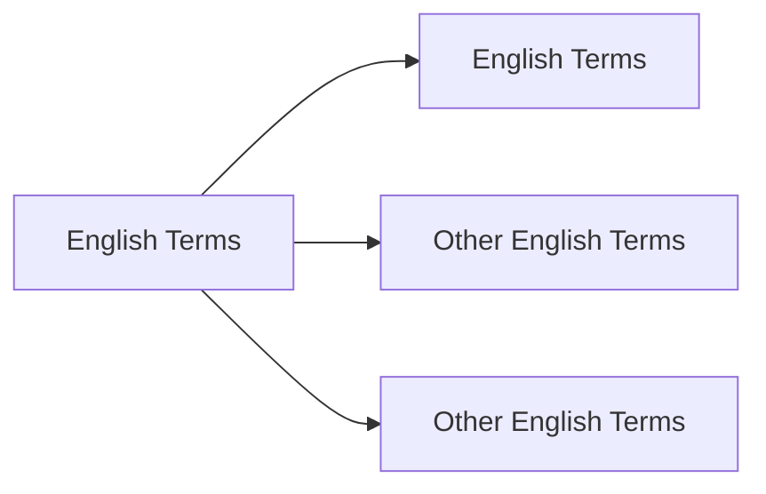

# **Unsheathed Terms Translation**  


# **Target to Finished**
No| Chapter | Days | Status |
 :---:|:---:| :---: | :--- |
1| 1-100 | 21-28 Dec 2024| 🚗 _On Progress_ |
2| 101-200 | 29 Dec- 5 Jan 2024| ❌ _Not Yet_ |


## Chapter 1 - 100  

s


```
New Terms
```



Translate based on [Gemini](www.gemini.google.com) and [ChatGPT](www.chatgpt.com)

>Mengembang
***
+ Bulging


>Naik
***
+ Perked
+ Perked Up

>Terus Menerus
***
+ Perpetually
+ Incessantly

>Sendawa
***
+ Burping

>Tegukan Besar
***
+ Swig 

>Besar
***
+ Immense

> Berjalan Perlahan
***
+ Shuffled Over

> Muncul Kembari
***
+ Resurfaced


> Tetes
***
+ Drip
+ Blob

> Batu Tulis
***
+ Slate

> Berair Enak
***
+ Succulent

> Teredam (Suara)
***
+ Muffled

> Cemplung
***
+ Plop


> Memikat
***
+ Bewitching

> Menggulung
***
+ Reeling in

> Hembusan Angin
***
+ Rustle

> Padi


***
+ Reeds 
+ Paddy (area)

> Miring
***
+ Cocked
+ Tilt

> Jalan Dengan Hati Hati
***
+ Discreetly
+ Tip-toe 

> Mengepakkan
***
+ Flapping
+ Fluttering

> Membalikkan
***
+ Flipping
 
> Terjatuh (Dengan Suara)
***
+ Flopping

> Bergegas
***
+ Scurried
+ Briskily (Lari Dengan Cepat)
> Mengapung (Di Udara, biasanya bau)
***
+ Wafted

> Mengepal Gigi 
***
+ Clenched
+ Gritted
+ Grin


> Menyeramkan
***
+ Ghastly
+ Eerie

> Objek yang bisa diikat
***
+ To Knot

> Ditenun
***
+ Weaved

> Kosong
***
+ Vacant

> Kilau 
***
+ Glistening
+ Sparkle
+ Dazzling (Mempesona)
+ Scintillating

> Menjadi Kusam/Hitam
***
+ Glimmering

> Ngomong Gak Jelas
***
+ Waffling

> Roti
***
+ Buns

> Menangani
***
+ Tackling

> Menghabiskan
***
+ Gobble

> Menyayangi
***
+ Doting

> Lobang Perbedaan
***
+ Gulf 
+ Gap

> Tidak Mencolok
***
+ Inconspicious

> Pelahap (makan banyak)
***
+ Glutton


> Kepuasan
***
+ Gratication

> Mengejek
***
+ Scoff

> Melahap Makanan
***
+ Scoff down

> Piring
***
+ Dish

> Ngorok
***
+ Snored

> Hama
***
+ Vermin

> Merangkak
***
+ Crawled

> Tajam 
***
+ Pricked

> Bergemuruh
***
+ Rumble

> Bergumam
***
+ Muttering
+ Mumbling

> Mengeluh
***
+ Grumbling

> Pemandangan yang mengganggu
***
+ Eyesore
+ Unsightly

> Nyonya
***
+ Missus

> Mati Rasa
***
+ Numb

> Omong Kosong
***
+ Gibberish

> Terbelakang
***
+ Retard

> Memperoleh
***
+ Elicit

> Jalan
***
+ Stride (Melangkah)
+ Stroll (Jalan)
+ Scurried (Jalan dengan langkah kecil)

> Mengepul
***
+ Billowing
+ Bergerak dan Terisi Udara ke luar

> Memaki 
***
+ Cuss

> Melolong (kayak au nya serigala)
***
+ Howling ( Bisa Berteriak juga)

> Orang Celaka
***
+ Wretch
+ Deplorable (sambil mengukut untuk orang celaka)

> Bahan Lilin
***
+ Wax

> Pekerjaan Sehari Hari (Rumah Tangga) / Rutin
***
+ Chores

> Rumput
*** 
+ Lawn

> Gak Peduli (Bahagia)
***
+ Frivolous

> Menanam
***
+ Sow

> Bingung
***
+ Mystified
+ Baffled
+ Bewildered
+ Persplexed
+ Stumped


> Berfikir
***
+ Mused (Think Deeply)
+ Mulled Over 

> Insinuation
***
+ Petunjuk Kecil (clue)

> Menentang
***
+ Against

> Kaget
***
+ Jolted

> MenggantI Rugi
***
+ Compensate(Membayar/Mengimbangi)

> Jatuh Cinta
***
+ Fallen Heads Over Heels

> Shoo
***
+ Mengusir

> Nakal
***
+ Sly

> Mengganggu
***
+ Pester
+ Nag

> Tutup Barang
***
+ Lid

> Menyempitkan Mata
***
+ Squinted

> Suara Nada Tinggi
***
+ Squeak
> Shrill

> Pangsit Cinta
*** 
+ Wontons

> Berantakan
****
+ Disheveled
+ Scruffy
+ Unkempt

> Kesal
***
+ Infuriated
+ Exasperated
+ Ticked off
+ Peeved
+ Aggravated

> Mengintip
***
+ Peep

> Menjilat 
***
+ Obsequiously
+ Fawning(berlebihan dalam memuji)
+ Flattery
+ Butter up

> Cerita
***
+ Recounts

> Terlarang
***
+ Illicit

> Dengan Panik
***
+ Frantically

> Sesuatu yang Besar
***
+ Heap

> Berteriak
***
+ Hooted

> Mencemooh
***
+ Heckled
+ Jibes

> Berlari dengan Cepat
***
+ Scooted

> Mereda
***
+ Subsided

> Kehijauan
***
+ Verdant
+ Lush

> Tidak Sejalan / Tidak Sesuai
***
+ Discordant
+ Erratic

> Keriput
***
+ Shriveled
+ Wrinkled

> Menjijikan
***
+ Vile
+ Repulsive
+ Loathing
+ Abhorrent

>  Tidak Penting 
***
+ Trifling

> Memecah
***
+ Wrack

> Kerinduan
***
+ Reminisence

> Berbicara Gagap 
***
+ Stutter
+ Stammered

> Halus
***
+ Fluffy

> Tertawa Kecil
***
+ Giggle

> Terpendam
***
+ Repressed
+ Pent-Up

> Tidak Komunikatif / Pasif / Pendiam
***
+ Taciturn
+ Reserved

> Berani / Sopan(sehingga cenderung menarik perhatian cwe)
***
+ Gallant
+ Chivalrous


> Permintaan yang sungguh sungguh
***
+ Pleading
+ Appeal

> Benci
***
+ Enmity
+ Bitterness
+ Animosities
+ Loath

> Mencekik / Membatasi
***
+ Stifling
+ Suffocating

> Menunjukkan Sifat Tidak Setuju dalam keadaan Serius
***
+ Stern

> Tidak Pasti Karena Bahaya
***
+ Precarious
+ Perilous (Pasti Bahaya)

> Menjelaskan secara Rinci 
***
+ Eludicate
+ Expounding


> Memukul
***
+ Banging

> Menarik
***
+ Tugged
+ Jerked

> Menyerah
***
+ Relenting

> Besar dan Kuat 
***
+ Burly

> Benjol / Membesar 
***
+ Swollen
+ Turgid

> Semangat / Yakin / Tertarik dengan sungguh sungguh
***
+ Fervent
+ Fervor
+ Frienziedly
+ Zealously

> Sangat Panas
***
+ Searing
+ Scorching

> Tenang
***
+ Composed
+ Collected
+ Placid

> Sombong / Merasa Diatas
***
+ Haughty
+ Condescending
+ Snobbish

> Resah
***
+ Agitation
+ Trepidation
+ Distraught (tapi sambil sedih juga)

> Hampir (Tapi ga terpenuhi)
***
+ Measly

> Ditebang
***
+ Felled

> Hujan Lebat
***
+ Downpours

> Atap dari Jerami atau Tanaman Semak
***
+ Thatched

> Sumber Sumur(Sumber Airnya)
***
+ Wellheads

> Gudang Penyimpanan
***
+ Trove

> Keributan
***
+ Fuss

> Kepala yang jatuh terlebih dahulu
***
+ Faceplanted

> Jalan di sebuah gunung cenderung ke atas
***
+ Ridge

> Tertidur tanpa Sengaja
***
+ Doze off

> Dengan Enggan, tapi tetap dilakukan
***
+ Begrudging

> Berjalan di Air
***
+ Waded

> Memeriksa sesuatu dengan hati hati
***
+ Sift

> Batu besar yang halus
***
+ Boulders

> Bintik
***
+ Specks

> Ekspresi Wajah yang Jijik
***
+ Grimaced

> Menghiasi
***
+ Adorn
+ Embroidered

> Pernak Pernik Kecil
***
+ Trinkets

> Bau yang sensitif
***
+ Pungent

> Mengawetkan Makanan
***
+ Pickling

> Meretas
***
+ Hacking

> Menetaskan
***
+ Hatching

> Makan Dikit Dikit
***
+ Nibble

> Lincah
***
+ Nimble

> Berjalan dengan Hati Hati
***
+ Crept

> Bahan untuk tulis menulis
***
+ Parchment

> Setengah Tenggelam
***
+ Immersed

> Menggerakan dengan halus
***
+ Slid

> Mengatakan sesuatu dengan tiba tiba
***
+ Blurt

> Tidak Menyenangkan
***
+ Unsavory

> Skirmish
***
+ Peperangan

> Jalan Besar
***
+ Swathes

> Kental
***
+ Viscous

> Mengecil / Kempes
***
+ Deflated

> Sulit untuk ditangkap
***
+ Elusive

> Melahirkan
***
+ Begets

> Tas dengan Tali 
***
+ Satchel

> Mengikat / Alat Ikat Pintu
***
+ Latch

> Ceroboh
***
+ Wanton
+ Sloppy

> Pengkhianatan
***
+ Treasonous
+ Treacherous

> Digoyangkan
***
+ Swayed

> Simpul
***
+ Knot

> Rajutan
***
+ Knit

> Kering
***
+ Parched

> Bergerak dengan cepat
***
+ Flitter
+ Trotting

> Aktivitas pada Daratan
***
+ Onshore

> Aktivitas pada Lautan
***
+ Offshore

> Tanduk
***
+ Antler

> Bingung
***
+ Daze

> Semak Berduri
***
+ Hawthorns

> Aneh
***
+ Eccentric

> Menyenggol / Dorongan secara halus
***
+ Nudge

> Menggemaskan
***
+ Adorable

> Kesuksesan Di Masa Depan
***
+ Auspiciousness

> Meremehkan
***
+ Belittling
+ Slighted

> Menepis
***
+ Brushed over it

> Gak Cocok
***
+ Misfit

> Bergerak 
***
+ Wiggle (Mengerakkan ke samping)
+ Wriggle (Mengerakkan masuk keluar)

> Praktik Disiplin garis keras
***
+ Ascetic

> Menaklukkan
***
+ Subjugate

> Dengan usaha yang keras
***
+ Strenous

> Pembantu(tapi tingkatannya lebih tinggi karena mengurus properti)
***
+ Steward

> Teliti
***
+ Meticulous

> Pengikut
***
+ Retainers

> Menggelantung ke bawah
***
+ Drooped

> Merapatkan / Memeluk
***
+ Snuggled

> Memabukkan
***
+ Intoxicating

> Mengakui
***
+ Concede

> Menonjol
***
+ Protrude

> Mendidih
***
+ Simmering

> Dimasak dengan Merebus
***
+ Braising

> Usil
***
+ Nosy

> Pucat
***
+ Ashen
+ Pale

> Cemberut
***
+ Sulky
+ Sullen

> Menyindir
***
+ Quipped

> Hemat
***
+ Thrifty
+ Frugal

> Menampakkan kesedihan
***
+ Melancholic
+ Gloomy
+ Pensive
+ Wistful
+ Forlorn
+ Grief-Stricken

> Bermalas malasan
***
+ Slack off
+ Perfunctory(gak malas, tapi effortnya sedikit)

> Dengan Mahir
***
+ Adeptly

> Menyeduh
***
+ Brew

> Kuda Kuda
***
+ Stances

> Ketat
***
+ Stringent

> Memutar
***
+ Twirling (lebih ke daun yang berputar setelah jatuh dari pohon)

> Goyah
***
+ Wobbed 
+ Waver

> Dengan Tajam
***
+ Acutely

> Aneh tapi menarik
***
+ Eccentric
+ Quirky

> Jelek
***
+ Shoddy

> Berbahaya
***
+ Detrimental
+ Prejudicial

> Khwatir
***
+ Apprehensive
+ Uneasy
+ Distress

> Meningkatkan
***
+ Temper(as a verb)

> Menilai
***
+ Appraise

> Pagar
***
+ Railings

> Berbelok
***
+ Veered off
+ Swerve

> Kaku
***
+ Clumsy
+ Fumbled (melakukan sesuatu dengan kaku)

> Benda Pusaka
***
+ Heirloom

> Dengan Sombong
***
+ Smugly

> Nginjek
***
+ Trample
+ Stomp

> Jatuh dengan kecepatan tinggi
***
+ Plummet

> Batu Asah
***
+ Whestone

> Menunjukkan Ketidaktertarikkan
***
+ Indifferent 

> Keramahan
***
+ Hospitality

> Mengidamkan
***
+ Coveting

> Kutil
***
+ Wart

> Lembah
***
+ Valley
+ Gorge(noun)

> Lari dengan Cepat(dimana semua kaki sampai tidak menyentuh tanah)
***
+ Galloping

> Menahan (Di bawah kendali)
***
+ In Check(idiom)

> Bergejolak
***
+ Upheaval

> Bergetar hebat
***
+ Convulsing

> Menurun
***
+ Waned

> Dipaksakan
***
+ Labored

> Lihai
***
+ Wily

> Pengungian
***
+ Refuge

> Tambahan
***
+ Afterthought

> Melemparkan
***
+ Hurl

> Tipuan / Umpan
***
+ Ruse

> Meronta Ronta
***
+ Flailed

> Tertawa
***
+ Chuckle
+ Chortle

> Gembira
***
+ Glee

> Keraguan
***
+ Qualms

> Konsekuensi/ Hasil yang tidak diinginkan
***
+ Repercussions

> Kesalahan
***
+ Oversights
+ Lapse

> Pengeluaran
***
+ Expenditure

> Memastikan
***
+ Ascertained

> Memeras (dengan cara yang curang)
***
+ Extorted

> Mengambil
***
+ Pounced

> Bobrok (rusak)
***
+ Dilapidated

> Posisi 
***
+ Stead

> Bahagia 
***
+ Elated
+ Ecstatic

> Enak 
***
+ Delectable

> Tidak Semangat
***
+ Lackadaisical
+ Despondence

> Perdebatan
***
+ Altercation

> Gelandangan
***
+ Vagrant

> Membangun
***
+ Erected

> Kecenderungan
***
+ Propensity

> Menggerakan dengan cepat 
***
+ Wagged

> Tangan Membentuk Sebuah Gelas (untuk menandakan hormat)
***
+ Cupped

> Masa Kejayaan
***
+ Heyday

> Tugas
***
+ Errand

> Intisari
***
+ Gist

> Dihancurkan sepenuhnya
***
+ Pulverized

> Ampuni
***
+ Pardon

> Tontonan
***
+ Spectacle

> Kapalan
***
+ Callouses

> Meresap
***
+ Permeating

> Memanfaatkan
***
+ Harness

> Baskom
***
+ Basins

> Marah karena perasaan tidak adil 
***
+ Indignant 

> Memohon dengan sungguh sungguh
***
+ Implored

> Ekspresi Lelah
***
+ Weary

> Take Matter
***
+ Mengambil Tindakan

> Ketabahan
***
+ Fortitude

> Berkumpul
***
+ Flock

> Perhatian 
***
+ Considerate

> Pikun
***
+ Senile

> Gagasan
***
+ Notion

> Ranting Kecil 
***
+ Twig

> Tidak Semestinya
***
+ Undue

> Jaminan
***
+ Bail

> Situasi yang Sulit 
***
+ Predicament

> Kurus Bertulang
***
+ Scrawny

> Tercampur
***
+ Mingled

> Kecil
***
+ Petty

> Menimbulkan
***
+ Inflict

> Ingkar Janji
***
+ Renege

> Kurang Sopan Santun
***
+ Uncouth

> Yang Mengetahui Rahasia
***
+ Privy

> Menyerah 
***
+ Relinquish

> Dikeluarkan
***
+ Incurred

> Curam
***
+ Steep

> Pengamat
***
+ Bystander

> Dibuat buat 
***
+ Contrived

> Kapak + Tombak (Senjata Gabungan)
***
+ Halberd

> Melakukan segala cara 
***
+ Leave no stone unturned (idiom)

> Sangat Menyakitkan 
***
+ Excruciating

> Compang Camping
***
+ Ragged

> Menjahit 
***
+ Needlework

> Melihat Dengan Derajat Yang Sama 
***
+ Peering

> Dengan Susah Payah
***
+ Arduously


> Siksaan / Rintangan
***
+ Arduously

> Memancing / Memprovokasi 
***
+ Goad

> Membayangkan
***
+ Envisioned

> Berasal dari 
***
+ Hailing

> Penuh
***
+ Fraught

> Berisik dan Tidak Teratur
***
+ Rowdy

> Memaksakan
***
+ Imposing

> Menarik Sesuatu yang Berat 
***
+ Hauling

> Posisi
***
+ Vantage

> Geraman
***
+ Snarl

> Mengeras menjadi butiran yang sebelumnya tetesan kecil 
***
+ Beaded up

> Menepuk 
***
+ Swatted

> Kecuali 
***
+ Barring

> Perawakan 
***
+ Stature

> Menegur 
***
+ Reprimanded
+ Admonished (tapi dengan tegas)

> Diselempangkan
***
+ Slung

> Keributan
***
+ Commotion
+ Tumult

> Memberikan Isyarat 
***
+ Beckoned

> Kata Kata Kutukan 
***
+ Profanity

> Mengurangi (Secara Bertahap)
***
+ Chip away

> Mendorong 
***
+ Propelling
+ Spur

> Menggelantung
***
+ Dangling

> Pendidikan 
***
+ Upbringing

> Parit / Got
***
+ Ditch
+ Moat

> Meletus Keluar 
***
+ Erupted out

> Penghargaan 
***
+ Accolades

> Luka Ringan 
***
+ Grazed (noun)

> Dengan Cepat (Tidak Peduli)
***
+ Breakneck

> Campuran (tanah, pasir dan debu) 
***
+ Loamy

> Mencengkeram
***
+ Latched

> Terjun 
***
+ Plunging

> Diperkecil 
***
+ Tapered

> Bernafas Dengan Cepat 
***
+ Panting

> Kera Baju Di Tangan 
***
+ Hem

> Menangis dengan Keras 
***
+ Bawling

> Merasakan Penghinaan 
***
+ Scorned

> Cemberut 
***
+ Sulky

> Serak 
***
+ Hoarse
+ Raucous

> Bersamaan (dalam konteks mengeluarkan suara)
***
+ Chorus

> Dengan Sopan 
***
+ Courteously
+ Graciously

> Kedai 
***
+ Tavern

> Mundur 
***
+ Flinched Back 
* Recoiled

> Bertemperamen Buruk (Marahan)
***
+ Surly

> Bersemangat
***
+ Feisty

> Punggungnya Menonjol
***
+ Hunched-Backed

> Garments 
***
+ Baju / Celana

> Titik Transisi / Ujung sebelum transisi
***
+ Cusp

> Memutuskan 
***
+ Sever

> Dengan Kotor / /Ga Jelas
***
+ Smudged

> Mengisi / Mengisi Ulang
***
+ Replenish

> Bagian Rahang / Tenggorokan Hewan
***
+ Maw

> Mendahului dalam posisi 
***
+ Overtaking

> Kebobolan 
***
+ Too Much Grounded

> Gemetar Luar Biasa 
***
+ Shudder

> Jatuh Secara Tiba Tiba 
***
+ Tumble

> Diletakkan Bersampingan 
***
+ Juxtaposed

> Dalam Bahaya / Jelas Jelas
***
+ Sanguine

> Meletakkan 
***
+ Wracked

> Menangis Karena Kesakitan 
***
+ Whimpered

> Membuka Mulut Lebar Lebar 
***
+ Yawning

> Menusuk dengan jari 
***
+ Prot 

> Menyerupai Lelucon 
***
+ Farcical

> Berbentuk Bulat 
***
+ Plump(Adjective)

> Berbicara Sesuatu yang tidak menarik 
***
+ Rattle on
+ Babbling 
+ Jabbing
+ Rambling

> Rakus 
***
+ Avaricious

> Tirai 
***
+ Drape

> Percaya 
***
+ Reckon

> Momen Menarik 
***
+ Enthralling

> Dengan Cara Yang Terampil 
***
+ Deftly

> Dengan Cara Yang Tidak Bisa Dirasakan 
***
+ Imperceptibly

> Misterius 
***
+ Uncanny

> Suara Yang Keras 
***
+ Thump

> Luka Panjang 
***
+ Gash


> Mendorong dengan keras 
***
+ Thrust

> Duduk dengan Berat 
***
+ Plonked

> Pandangan Kabur 
***
+ Fuzzy

> Tidak Ketat 
***
+ Lenient 

> Telah Ditentukan 
***
+ Preordained

> Mengabaikan / Mengalihkan Sesuatu 
***
+ Shrug off

> Tidak Menarik 
***
+ Bleak

> Kondisi Baik
***
+ Dandy

> Memperburuk
***
+ Exacerbated

> Basah Kuyup
***
+ Drenched

> Tidak Terkotaminasi 
***
+ Untainted

> Potongan Panjang
***
+ Grooves

> Batu Asah
***
+ Whestones

> Setengah Sadar
***
+ Trance

> Ekspresi Tidak Setuju, Jijik
***
+ Grimaced

> Dengan Cara Yang Tidak Tahu Malu dan Terang Terangan 
***
+ Brazenly

> Tepi Luar 
***
+ Rims

> Lemah 
***
+ Feeble

> Berpengalaman
***
+ Well-Versed

> Menyanjung 
***
+ Flatter

> Memarahi dengan halus 
***
+ Chided

> Lemah Lembut 
***
+ Meek

> Merendahkan (Menurunkan Harga Diri Seseorang)
***
+ Demeaning

> Memancarkan 
***
+ Exuded

> Asyik (Sepenuhnya menyerap)
***
+ Engrossed
+ Riveting

> Kesopanan 
***
+ Decorum

> Kejujuran 
***
+ Uprightness

> Kecenderungan Untuk Marah
***
+ Irrasible

> Menunjukkan Ketidaksetujuan
***
+ Deprecating

> Melepaskan Diri dari Kekangan 
***
+ Bridle

> Berpura Pura 
***
+ Feigned

> Overcast 
***
+ Mendung

> Penghinaan / Merendahkan 
***
+ Derogatory
+ Disparaging

> Mirip 
***
+ Kindred

> Gerimis 
***
+ Drizzle

> Berteriak 
***
+ Bellowed

> Secuil 
***
+ Shred

> Permohonan
***
+ Imploration

> Penakluk
***
+ Vanquisher

> Meniup
***
+ Puff

> Rapuh 
***
+ Crisp

> Bagian keras dari Kaki Mamalia
***
+ Hooves

> Hal Hal Penting dari Sesuatu 
***
+ Substantial

> Suara Kuku Kuda
***
+ Clopping

> Berlari dengan Kecepatan Sedang 
***
+ Trotted

> Jijik yang Luar Biasa 
***
+ Revolting

> Ikut Campur 
***
+ Stuck Its Nose (Idioms)

> Dipenuhi dengan kata kata kasar atau kritik 
***
+ Vitriolic

> Tidak Menyenangkan 
***
+ Grating

> Liar 
***
+ Frantics

> Mengerutkan Kening Sambil Marah 
***
+ Scowled

> Pergi dengan Segera 
***
+ Scram

> Pohon dengan daun sempit 
***
+ Willow

> Sesuatu yang Menyulitkan 
***
+ Hassle

> Memutuskan untuk melakukan sesuatu 
***
+ Hellbent

> Sulit untuk dilewati 
***
+ Impervious

> Membentak dengan Marah 
***
+ Berate

> Situasi yang Berbahaya 
***
+ Plights

> Ditertawai / Menjadi Bahan Lelucon
***
+ Ridiculed

> Bersaing Dengan Semangat 
***
+ Vying

> Gak Puas 
***
+ Disgruntled

> Berbicara mengenai (sesuatu yang tidak menyenangkan, membosankan , dsb)
***
+ Dwell

> Setuju 
***
+ Concurred

> Tepi Atap Yang Menggantung
***
+ Eaves

> Kemegahan dan Keindahan 
***
+ Grandeur

> Murah Hati dan Pemaaf
***
+ Magnanimous

> Bergerak dengan lambat dan berat di atas roda 
***
+ Trundled

> Meninggalkan / Turun 
***
+ Disembark 

> Cantik dan Kecil Imut
***
+ Dainty
+ Petite

> Secara Ragu Ragu
***
+ Tentatively

> Memotong Bagian 
***
+ Dismembered

> Mengarahkan Seseorang 
***
+ Funneled

> Bergerak dengan Cepat
***
+ Budge

> Kemampuan untuk menilai sesuatu 
***
+ Astutely

> Marah Besar
***
+ Livid

> Pembimbing
***
+ Preceptor

> Diskusi Lisan atau Tulisan
***
+ Discourse

> Mengomel
***
+ Fuming

> Sesuatu yang kurang baik dari kualitas atau kuantitas 
***
+ Meager

> Orang yang hidup dalam pengasingan 
***
+ Recluse

> Remaja
***
+ Adolescent
+ Juvenile

> Menarik Napas Secara Tiba Tiba
***
+ Gasp

> Dipenuhi
***
+ Riddle

> Surut
***
+ Recede

> Degradasi
***
+ Relegated

> Meratap
***
+ Wail

> Kesedihan
***
+ Anguish

> Senang Hati
***
+ Relish
+ Bliss
+ Elation

> Menutupi Sesuatu dengan Kain 
***
+ Draping

> Sangat Perhatian dengan Detail
***
+ Fastidious

> Perjalanan yang Sulit
***
+ Trek

> Kualitas Menjadi Penuh Energi
***
+ Exuberance

> Menjadi sangat Marah 
***
+ Fumed

> Yang tidak diragukan lagi
***
+ Indubitable

> Meratapi
***
+ Lamented

> Makan Dengan Berisik
***
+ Munching

> Bergerak seperti ombak 
***
+ Undulating

> Berlanjut setelah koid
***
+ Posthumous

> Suara yang tajam
***
+ Clack

> Kelancangan
***
+ Impudence

> Kejadian yang tiba tiba 
***
+ Flurries

> Sesuatu yang berurutan
***
+ Procession

> Tahap Senja yang lebih gelap
***
+ Dusk

> Mengupas
***
+ Husk (verb)

> Bagian sesuatu yang tidak penting
***
+ Husk (noun)

> Kosong
***
+ Empty Husk

> Memberikan Energi Baru atau Kekuatan
***
+ Reinvigorating

> Perasaan Senang
***
+ Exhilaration

> Dibatasi dari kemampuan normalnya 
***
+ Handicapped

> Tidak Lagi Valid
***
+ Lapse

> Kosong
***
+ Hollowing

> Hobi
***
+ Pastime

> Tidak Bermoral
***
+ Unscrupulous

> Meleset
***
+ Errant

> Perpisahan
***
+ Fleeting

> Bersinar
***
+ Gleam

> Berbicara secara tidak jelas 
***
+ Mince

> Tempat Gak Baek
***
+ Brothels

> Memuji
***
+ Lauds

> Tenang
***
+ Placid

> Meletus
***
+ Erupted

> Istirahat dalam periode sebentar
***
+ Respite

> Dikurangi secara bertahap
*** 
+ Whittled Down

> Menyelipkan
***
+ Tucked

> Menggelegar
***
+ Jarring

> Ditetapkan
***
+ Stipulated

> Bekerja dengan Keras
***
+ Toiling away

> Marah
***
+ Ire

> Kue Kering
***
+ Pastries

> Pelanggan Tetap
***
+ Patron

> Dengan Tegukan Besar 
***
+ Swig

> Untuk menyentuh dengan halus
***
+ Dabbed

> Gak Sesuai dengan rencana awal
***
+ Awry

> Botol Besar 
***
+ Flagon

> Pemasukan
***
+ Revenue

> Membuat lubang dengan menggali
***
+ Excavate

> Menyampaikan / Ngirim Informasi
***
+ Relay

> Memperkuat
***
+ Bolster

> Ditunjukkan dengan sepenuh hati 
***
+ Unreserved

> Situasi yang tidak ada kemajuan
***
+ Stalemate

> Mengemas atau menimpan sesuatu 
***
+ Stow

> Membuang dengan Sembrono
***
+ Squander

> Jumlah uang yang harus dibayar secara terus menerus
***
+ Dividends

> Menyebalkan / Mengesalkan
***
+ Irked
+ Irritated
+ Bugged
+ Tick Off

> Ditipu oleh sesuatu
***
+ Bluffing

> Dikeluarkan secara berlebihan
***
+ Splurge

> Bergerak dengan Cepat
***
+ Bolted

> Secara tidak informal
***
+ Colloquially

> Yang Disebut Sebelumnya
***
+ Aforementioned

> Jumlah terkecil
***
+ Tinges

> Memulai
***
+ Commence

> Tidak Disetujui
***
+ Frowned Upon

> Dimiringkan
***
+ Slanted

> Bau Sedikit
***
+ Whiff (noun)

> Miss
***
+ Whiff(verb)

> Tindakan atau Praktik Keagamaan
***
+ Rites

> Bagian Kecil
***
+ Wisp

> Menyebabkan
***
+ Instigate

> Perintah
***
+ Behest

> Bergerak Seperti Gelombang
***
+ Undulating

> Mengembalikan Kepercayaan
***
+ Reassuring

> Makanan Binatang
***
+ Forage

> Dipenuhi / Diisi
***
+ Laden
+ Swarming
+ Teeming

> Perjuangan Yang Kuat
***
+ Vigorous Struggle

> Tersebar
***
+ Dotted

> Menonjol
***
+ Jutting

> Membengkok dengan Mudah
***
+ Lithe

> Mewah dan Berlimpah / Memberikan dengan dermawan
***
+ Lavish 
+ Opulent

> Sesuatu kejadian yang dapat dijadikan contoh
***
+ Precedent

> Tidak Sepenuhnya Sadar
*** 
+ Unwitting

> Penghargaan atau Hak Istimewa yang diberikan sebagia kehormatan khusus
***
+ Accolades

> Keputusan atau Pendapat
***
+ Verdict

> Kesengsaraan
***
+ Woes

> Memberikan Sanksi kepada Otoritas tertentu 
***
+ Impeached

> Tempat Tinggal
***
+ Abodes

> Sepotong Kotoran
***
+ Turds

> Dirasakan dengan Tulus
***
+ Heartfelt

> Pemotongan Pohon
***
+ Felling

> Sekolompok Orang mengelilingi sesuatu
***
+ Entourage

> Seseorang yang mengajukan teori
***
+ Proponents

> Lembab
***
+ Clammy

> Mengenang
***
+ Commemorate

> Kefasihan dalam Berbicara
***
+ Eloquence

> Anggun
***
+ Graceful
+ Poise

> Busuk
***
+ Putrid

> Senyum dengan Senyuman yang merasa diatas 
***
+ Smirk

> Berkomitmen dan Siap Memulai
***
+ Undetake

> Dibalas (dalam perbuatan)
***
+ Requited

> Mengumpulkan
***
+ Garner

> Memodifikasi
***
+ Amended

> Mengirimkan Air Secara Paksa
***
+ Spouted

> Seringkali digunakan sehingga kualitasnya berkurang
***
+ Cliched

***
+ Accrual

> Luar bisa untuk Diatasi
***
+ Insurmountable

> Berbagi sesuatu yang rahasia
***
+ Privy

> Melawan Tuhan
***
+ Blasphemous

> Bersama
***
+ Tandem

> Mengkritik dengan Kasar
***
+ Lambasted

> Seseorang yang memicu sebuah masalah
***
+ Rabble Rousers

> Ganas
***
+ Savages

> Periode memegang posisi
***
+ Tenure

> Pantat
***
+ Haunches
* Arse

> Melaporkan
***
+ Denouncing

> Tidak Mungkin
***
+ Far Fetched

> Seseorang yang mudah dibujuk
***
+ Pushover

> Kegembiraan
***
+ Mirth
+ Exultation

> Komitmen kepada atasan
***
+ Allegiance

> Alasan Palsu untuk menutupi sebuah informasi
***
+ Pretense

> Kualitas untuk menjadi semangat dan ramah
***
+ Geniality

> Mencegah
***
+ Stave off
+ Deter

> Siasat Licik
***
+ Wiles

> Tidak Menarik dan Tidak Ramah
***
+ Bleak

> Kehormatan
***
+ Regard

> Basa Basi
***
+ Pleasantries

> Mengeluarkan
***
+ To Tip Out

> Dirancang Secara Pintar
***
+ Ingenious

> Perasaan sesuatu yang buruk akan terjadi
***
+ Foreboding

> Memiliki titik yang tajam
***
+ Barbed

> Memiliki Efek Menenangkan Yang Lembut
***
+ Soothing Voice

> Logis Dan Konsisten 
***
+ Coherent

> Pembohong
***
+ Crook

> Kemungkinan
***
+ Presumably

> Meyakinkan
***
+ Reassure

> Menjamin
***
+ Vouch

> Dalam Ketakukan
***
+ In Alarm

> Menyaksikan
***
+ Looked On
+ Bystander

> Terkejut Sampai tidak Dapat Berkata kata
***
+ Dumbstruck

> Telah Sadar
***
+ Dawn on him

> Mengalir secara bertahap ke bawah
***
+ Cascade

> Malas / Miring
***
+ Slouches

> Tidak Berbukti / Tidak Berdasar
***
+ Unsubstantiated

> Mengekstrak atau Mengumpulkan Informasi
***
+ Glean

> Mendekati dengan cara memiringkan / geser
***
+ Sidled up

> Mengeluarkan / Mengeksprikan 
***
+ Fared

> Secara Diam Diam
***
+ Furtively

> Bergengsi
***
+ Prestigous

> Uang yang diperoleh
***
+ Proceeds

> Meredup
***
+ Fizzled Out

> Karya Seni di dinding 
***
+ Mural

> Daya Tarik
***
+ Allure

> Kekurangan
***
+ Deprived

> Didirikan
***
+ Inception

> Kemunduran
***
+ Setback

> Kerusuhan
***
+ Tumoltous

> Roboh
***
+ Toppled

> Bergerak Secara Gelisah dan Diam Diam
***
+ Prowling

> Sezaman
***
+ Contemporaries

> Bergerak dengan Cepat dan Menyusul
***
+ Outstrip

> Tiran
***
+ Despotic

> Rumit atau terbelit belit
***
+ Convoluted

> Tidak Pantas
***
+ Unbecoming

> Untuk Memunculkan sesuatu secara tidak nyata
***
+ To Conjure

> Gila
***
+ Deranged

> Berbicara dengan nada marah dan kasar
***
+ Snarled

> Suara yang kasar
***
+ Raspy

> Bersujud (merendahkan dirinya)
***
+ Groveled

> Laron
***
+ Moths

> Licik / Curang
***
+ Devious

> Jatuh / Duduk
***
+ Slumped

> Peralatan
***
+ Rig

> Kelegaan Psikologis
***
+ Cathartic

> Tempat Sementara
***
+ Makeshift

> Memprovokasi
***
+ Goads

> Gelap , Tidak Jelas
***
+ Murkier

> Makan Dengan Berisik
***
+ Chump

> Memegang dengan Lembut
***
+ Cradled

> Well-Rehearsed
***
+ Terlatih

> Bagian organ binatang
***
+ Innards

> Curian
***
+ Haul

> Kapalan
***
+ Blisters

> Memeres (kayak handuk untuk ngeluarin air)
***
+ Wring out

> Kumis binatang
***
+ Whiskers

> Lesu
***
+ Languid
+ Sapped

> Masih Bersemangat
***
+ Raring

> Tidak Percaya
***
+ Incredulity

> Barang Tipis terbuat dari Kayu
***
+ Wooden Poles

> Penutup Bangunan
***
+ Rooves

> Sesuatu campuran
***
+ Concoctions

> Menyelinap
***
+ Snuck

> Menghasilkan sesuatu yang menguntungkan
***
+ Lucrative

> Penimbun Kekayaan
***
+ Miser

> Cara Jitu
***
+ Surefire

> Bergerak dengan Cepat
***
+ Darting

> Orang yang tidak menganut apapun
*** 
+ Heathen

> Di bawah bimbingan
***
+ Tutelage

> Menghirup Ingus
***
+ Sniffling

> Dangkal
***
+ Superficial

> Digesek
***
+ Chafed

> Menolak untuk diizinkan
***
+ Forbade

> Babak Belur
***
+ Pulp

> Wadah Kecil (untuk menyimpan air)
***
+ Canteen

> Berbentuk Cone
***
+ Conical

> Tidak Berbahaya
***
+ Innocuous

> Menyatakan Ketidaksetujuan
***
+ Reprimanding

> Tali Kekang Kuda
***
+ Reins

> Bergerak / Memakan Rumput
***
+ Graze (verb)

> Tidak Terbalas
***
+ Unrequited

> Memberikan Isyarat / Menyarankan
***
+ Alluding

> Kurang Ajar
***
+ Impudent
+ Impertinent

> Tali atau benang yang diikat longgar sebagai perhiasan
***
+ Tassels

> Membungkukkan Badan 
***
+ Stooping

> Sangat Menyedihkan / Mengerikan
***
+ Harrowing
+ Dismal

> Pujian yang sok
***
+ Pretentious
+ Ostentatious(mencolok)

> Mantra
***
+ Incantation

> Bersatu
***
+ Conjoined

> Hal Terpenting
***
+ Crux

> Ternoda / Kehilangan Kilauan
***
+ Tarnished

> Dipancarkan
***
+ Emanating

> Ditinggalkan / Diabaikan
***
+ Vacated

> Air Garam (biasanya untuk diawetkan / dibumbui)
***
+ Brined

> Beragumen / Ribut 
***
+ Bickering

> Memukul berulang kali
***
+ Pummel

> Secara Tipis / Samar Samar
***
+ Subtly

> Menggantikan
***
+ Superseded

> Keinginan Kuat
***
+ Craving

> Kawin Lari
***
+ Eloped

> Dikumpulkan dan Digabungkan
***
+ Collate

> Turun dengan Cepat
***
+ Swoop in

> Bertarung dan berjuang untuk sesuatu
***
+ Scramble

> Membangkitkan Antusias
***
+ Rousing

> Bertahan lebih lama
***
+ Outlast

> Menyelamatkan
***
+ Salvage

> Menjahit / Menggabungkan
***
+ Stitched

> Meremas (untuk membunuh)
***
+ Strangling

> Dalam Kutukan
***
+ Accursed

> Penyebaran Penyakit Berbahaya atau semacamnya
***
+ Insidious

> Jatuh secara cepat
***
+ Pelting

> Merampas
***
+ Encroached
+ Usurping

> Menafsirkan secara salah
***
+ Misconstrued

> Gegabah
***
+ Rash

> Gagah
***
+ Valiant

> Meringis Kesakitan
***
+ Winced

> Akibatnya
***
+ Ensued

> Seseorang yang tidak setuju dengan mayoritas
***
+ Dissenters

> Perintah
***
+ Edict

> Pas Pasan meraih sesuatu
***
+ Scrape

> Prospek masa depan
***
+ Outlook

> Moan
***
+ Mengerang

> Groan
***
+ Merintih

> Menggambarkan sesuatu
***
+ Scribbling

> Sedih
***
+ Glum

> Diberikan / Dikabulkan
***
+ Conferring

> Menegur / Mengungkapkan ketidaksetujuan
***
+ Rebuked

> Peringatan
***
+ Memorial

> Sarana lain untuk tujuan tertentu
***
+ Wherewithal

> Tenang
***
+ Serenity

> Sangat Buruk
***
+ Egregious

> Tua dan Robek
***
+ Tattered

> Bersenang Senang
***
+ Reveled

> Balok Penopang Atap
***
+ Rafters

> Kuda
***
+ Steeds

> Lembah
***
+ Gully
+ Ravines

> Mendengar tanpa sengaja
***
+ Overhearing

> Mengumpulkan Informasi / Petunjuk
***
+ Glean

> Tampilan
***
+ Semblance

> Menerkan
***
+ Pounce

> Suara Dering
***
+ Chiming

> Dibakar
***
+ Alight

> Mencelupkan
***
+ Dipping

> Berubah Ubah
***
+ Fickle

> Bangunan Agama yang diisi oleh Monks
***
+ Monastery

> Didaftarkan secara list
***
+ Cataloged

> Menyebar tak terkendali
***
+ Rampant

> Titik Spesifik/ Penggabungan dua
***
+ Juncture

> Memamerkan
***
+ Flaunt

> Bersin
***
+ Sneeze

> Sabut
***
+ Coir

> Nangis
***
+ Weep

> Megah
***
+ Splendor

> Merasa Seseorang Tidak Pantas, Tidak Layak Dipertimbangkan
***
+ Contempt
+ Derision (dengan cemoohan)
+ Derided

> Permintaan secara sungguh sungguh
***
+ Plea

> Menjadi layu atau kehilangan energi
***
+ Wilt

> Sangat Jelek
***
+ Hideous

> Halus dan Mengkilap
***
+ Slick

> Tidak Jelas
***
+ Muddy

> Dalam Bahaya
***
+ Peril

> Kesenangan yang didapat dari ketidakberuntungan orang lain
***
+ Schadenfreude

> Berlumuran
***
+ Splattered

> Bodoh, Gila
***
+ Antics

> Didukung
***
+ Buoyed
+ Emboldened

> Kesulitan atau Malu
***
+ Chagrin

> Daratan Yang Rata ( di daratan tinggi )
***
+ Plateau

> Membentuk
***
+ Mold

> Berlagak Sombong / Berjalan dengan Sombong
***
+ Swaggered

> Tumpukan Tanah
***
+ Mound

> Dikelilingi
***
+ Enclosed
+ Wreath

> Tidak Masuk Akal
***
+ Far-fetched
+ Implausible

> Bertahan
***
+ Get By

> Bergerak dengan cara memutarkan badan seperti ular
***
+ Slithered

> Membanggakan kesuksesan
***
+ Gloating

> Menggerakan Bagian Tubuh
***
+ Flailing

> Memukul berulang kali
***
+ Pounding

> Air Liur
***
+ Spittle

> Tertawa dengan keras
***
+ Cackled

> Gila
***
+ Frenzy

> Menyebar dengan cara acak
***
+ Straggling

> Situasi tidak ada kemajuan
***
+ Impassed

> Pekerjaan dengan tenaga besar
***
+ Herculean Task

> Ngeces
***
+ Drool

> Bergerak dengan sangat cepat tapi tidak terkontrol
***
+ Barreled

> Palu
***
+ Mallet

> Tidak Menyenangkan/ Menyeramkan yang menyebabkan rasa jijik
***
+ Gruesome

> Bergerak atau manjat dengan susah payah
***
+ Clambered

> Seperti Goa
***
+ Cavernous

> Merubah Arah secara langsung untuk menghindari
***
+ Swerved Over

> Rapuh
***
+ Brittle

> Halus
***
+ Sleek

> Mengakhiri
***
+ Quell

> Jelas
***
+ Pronounced

> Dilemahkan
***
+ Delibitated

> Menggeledah
***
+ Rummaging

> Matang
***
+ Ripe

> Gading (seperti gajah berwarna putih)
***
+ Ivory

> Menjadi Muak
***
+ Nauseating

> Sinis
***
+ Snide

> Siap Menerima / Patuh
***
+ Docile

> Lumpur atau campuran kentel lain
***
+ Sludge

> Kegembiraan luar biasa
***
+ Exhilarated

> Kebijaksanaan
***
+ Discretion

> Tempat Akomodasi 
***
+ Berth

> Dipenuhi dengan intens, kemarahan yang tidak diuangkapkan
***
+ Seethed

> Godaan
***
+ Enticements

> Jenis Berbeda
***
+ Disparate

> Lubang
***
+ Burrows

> Tidak terus terang
***
+ Rounabout

> Mendominasi dengan cara yang tidak menyenangkan
***
+ Overbearing

> Keputusan / Deal
***
+ Concession

> Taruhan
***
+ Wager

> Tidak Masuk Akal
***
+ Preposterous

> Berpikir dengan serius
***
+ Ruminating

> Pecah
***
+ Splintered

> Merusak tampilan sesuatu
***
+ Disfigured

> Mengeluarkan suara tidak setuju secara halus
***
+ Clucked

> Bentrokan / Perkelahian Kecil
***
+ Skirmishes

> Cara Yang Kotor
***
+ Sordid

> Tanaman Kayu yang pendek dengan beberapa batang
***
+ Shrub

> Kantong Empedu
***
+ Gallbladder

> Ujung dari sesuatu area tertentu
***
+ Fringes

> Membawa atau memindahkan sesuatu secara cepat
***
+ Whisked away

> Dahulu Kala
***
+ Immemorial

> Menggugah Selera
***
+ Appetizing
+ Scrumptious

> Mengelus secara halus
***
+ Caress

> Sutra
***
+ Silk

> Kain
***
+ Fabric

> Kain dengan Desain Bagus, terbuat dari emas atau silver
***
+ Brocade

> Inti Kayu
***
+ Ebony

> Terkait
***
+ Pertained

> Sistem Timbal Balik atas Perlindungan
***
+ Feudal

> Mendaftarkan
***
+ Enlisted

> Memamerkan
***
+ Flaunt

> Mengulurkan Leher
***
+ Cranes

> Bertambah terus
***
+ Accrues

> Meraung dengan kemarahan
***
+ Bellow

> Berisik / Penuh Aktivitas
***
+ Bustling

> Tusuk ( buat menahan makanan , kayak ayam, sate dsb)
***
+ Skewers

> Tumbuhan Mata Lele
***
+ Duckweed

> Banyak garis di kertas / Lecek
***
+ Crinkled
+ Crumpled
+ Creases

> Kaget Luar Biasa
***
+ Astonished
+ Flabbergasted


> Mencengangkan 
***
+ Astounding 

> Hakim
***
+ Magistrate

> Dokumen berisi list perjalanan yang akan dilewati / rencana perjalanan
***
+ Itinerary

> Pasukan
***
+ Garrison

> Tidak Ketat
***
+ Lax

> Menara Lampu
***
+ Beacon

> Berisik, Gaduh
***
+ Boisterous
+ Rowdy

> Berteriak dengan kuat
***
+ Hollering

> Tawar menawar atau perselihan secara terus menerus
***
+ Haggling

> Berat
***
+ Hefty

> Dermaga
***
+ Dock

> Jam Malam (berdiam di ruangan)
***
+ Curfew

> Sebuah Area Air yang sempit tapi menjulur ke area daratan
***
+ Inlet

> Pekerja wanita 
***
+ Hostesses

> Layak Mendapat Pujian
***
+ Meritorious

> Sangat Besar
***
+ Whopping

> Tidak Bersemangat / Tidak Penuh Energi atau Antusias
***
+ Listless

> Tingkat laku wanita (padahal cowo)
***
+ Effeminate

> Tidak Dapat Diterima / Layak dikecam
***
+ Deplorable

> Suara gedebug (barang berat jatuh)
***
+ Thud

> Sedih
***
+ Mopey

> Batu terletak di air tinggi sampai keatas permukaan
***
+ Reefs

> Daerah peraian yang Dangkal
***
+ Shoals

> Melancar di atas permukaan
***
+ Skimming

> Harga tinggi tidak masuk Akal
***
+ Exorbitant

> Membengkokan dengan mudah dan indah
***
+ Supple

> Meminta / Membujuk seseorang untuk melakukan bisnis (tidak baik)
***
+ Soliciting

> Menjalankan
***
+ Faring

> Menawarkan
***
+ Peddling

> Terikat
***
* Hitch

> Menulis secara cepat dan singkat
*** 
+ Jotted

> Diberikan / Dikabulkan
***
+ Conferred

> Mengeluarkan bau tidak sedap
***
+ Reeked

> Menyampaikan dengan perasaan sedih dan serius
***
+ Somber

> Mengancam Bahaya
***
+ Baleful

> Perasaan Hangat / Antusiasme
***
+ Ardor

> Kotak Untuk Membakar Dupa  
***
+ Censer

> Dengan cara Hemat 
***
+ Frugal
+ Sparingly

> Observasi Militer untuk menemukan target / Pengematan Militer
***
+ Reconnaisance

> Salah 
*** 
+ Erroneous

> Bergerak dengan suara siulan atau mendesis 
***
+ Swished

> Dibatalkan/Dipadamkan 
***
+ Quashed

> Rapih
***
+ Immaculate

> Menghancurkan 
***
+ Obliterate

> Pagar 
***
+ Railing

> Mengantuk 
***
+ Drowsy

> Menginformasikan 
***
+ Dob

> Tidak Dapat Dijalankan 
***
+ Outworn

> Seseorang yang berfikir keras dan lama 
***
+ Contemplatives

> Tercampur 
***
+ Mingling

> Bergerak dengan cepat 
***
+ Whizzing 

> Menghidari / Mengabaikan 
***
+ Shirk

> Gugup atau tidak rileks
***
+ Jittery

> Mendayung 
***
+ Paddled

> Menyamarkan 
***
+ Obscuring

> Memanjakan 
***
+ Coddle

> Bergerak secara cepat atau ragu ragu 
***
+ Scuttled

> Keinginan yang tidak dapat ditahan
***
+ Compulsive

> Secara bertahap menyebar 
***
+ Suffusing

> Gumpalan Asap
***
+ Plumes

> Membuat Tanda 
***
+ Blotting

> Petasan 
***
+ Firecracker 

> Mengumpulkan dan Menyembunyikan 
***
+ Hoard

> Tergeletak 
***
+ Sprawled

> Keterasingan / Perpisahan 
***
+ Estrangement

> Melanggar 
***
+ Trangresses

> Bangkai Hewan
***
+ Carcass

> Menduga 
***
+ Surmised

> Enggan
***
+ Averse

> Tidak Tepat / Tidak Menjanjikan 
***
+ Inauspicious

> Meniru 
***
+ Emulated

> Raungan 
***
+ Bellow

> Bergoyang cenderung akan jatuh
***
+ Teetering

> Kasar 
***
+ Brusque

> Sikap tidak hormat 
***
+ Gall

> Daun Bawang 
***
+ Chives

> Bergerak tidak stabil 
***
+ Staggered

> Pemahanan yang tajam 
***
+ Percipient

> Perut 
***
+ Tummy

> Meletakkan Ke bawah 
***
+ Plonked Down

> Bingung
***
+ Muddle

> Teman sekaligus Musuh
***
+ Frenemies

> Meminta 
***
+ Canvassing

> Kagum
***
+ Marvelling

> Menangis dalam nada tinggi 
***
+ Shrieked

> Menyiapkan 
***
+ Curry

> Paham tanpa diberitahukan 
***
+ Tacit

> Penguasa yang absolut 
***
+ Autocratic

> Sebuah dorongan baru / gaya yang membuat sesuatu terjadi lebih cepat 
***
+ Impetus

> Mencabut / Membatalkan 
***
+ Revoke 
+ Rescind

> Tepi jalan atau Trotoar 
***
+ Curb

> Outlived 
***
+ Live longer than

> Berbicara atau Bertindak dengan mengelak 
***
+ Prevaricate

> Pengangkatan Status 
***
+ Apotheosis 

> Menutupi (dalam mengelaborasikan)
***
+ Glossed Over

> Popularitas 
***
+ Coattails

> Dilapisi emas secara tipis 
***
+ Gilded

> Kontak Peminjaman Sewa 
***
+ Lease

> Kulit yang menutupi atas kepala 
***
+ Scalp

> Titik Puncak tertinggi 
***
+ Zenith

> Berkumpul ramai ramai 
***
+ Huddle
+ Throngs (tapi ini lebih dipaketkan satu satu)

> Resah dan Bingung 
***
+ Flustered

> Suara Keras dan Kasar 
***
+ Bray

> Pencapaian yang berani 
***
+ Exploits

> Berdamai 
***
+ Cotton up

> Jelas dan Bening 
***
+ Limpid

> Dengan cara yang sambil pusing 
***
+ Giddily

> Kotoran / Mengotori 
***
+ Muck

> Kabur 
***
+ Shied away

> Rentetan 
***
+ Barraged

> Menimpa  
***
+ Plagued
+ Afflict

> Terjebak 
***
+ Bogged Down

> Tandu 
***
+ Stretcher

> Metode Ramal dengan meletakkan batu 
***
+ Geomancy

> Mengucilkan 
***
+ Ostracize

> Polos tanpa ada tipuan 
***
+ Guileless

> Dengan penuh perhatian 
***
+ Attentively

> Secara terang terangan mengabaikan 
***
+ Flout

> Keputusan Bersama dan Bulat 
***
+ Unanimous

> Tidak dapat dibayangkan 
***
+ Incoceivable

> Mengambil tindakan keras untuk mencegah
***
+ Cracked Down

> Menyanggah 
***
+ Debunked

> Lemah dan Tidak Meyakinkan 
***
+ Lame

> Roh Jahat 
***
+ Fiends

> Kepink dan merahan 
***
+ Rosy

> Langsung / Tidak Sopan 
***
+ Offhand

> Pergerakan Cairan 
***
+ Trickle

> Hidup dari orang lain 
***
+ Sponging (figurative)

> Antusias dengan rasa makan / rakus
***
+ Voracious

> Rendah Hati 
***
+ Demure

> Terluka Parah 
***
+ Blasterd

> Smithereens 
***
+ Pecahan Kecil

> Suram
***
+ Dreary

> Rawa 
***
+ Marshes

> Berpergian dan Berpindah Pindah
***
+ Itinerant

> Menganggu 
***
+ Intruded

> Membongkar 
***
+ Dismantle

> Mengolesi
***
+ Smearing

> Kemilau 
***
+ Sheen

> Berderak / Retak 
***
+ Crackling

> Dengan Lemas 
***
+ Limply

> Salam Penghormatan 
***
+ Curtsy

> Lemot 
***
+ Sluggish

> Surut 
***
+ Ebbing

> Rusak atau memburuk 
***
+ Crumble

> Celah 
***
+ Fissures

> Kurungan 
***
+ Coop

> Merusak kedua belah pihak
***
+ Intermecines 

> Gagal untuk menahan tekanan, menyerah, dan mati
***
+ Succumbing

> Lucu 
***
+ Comical

> Menjadi Nyata / Muncul secara tiba tiba
***
+ Materialized

> Ketukan
***
+ Pitter-Patter

> Mengunjungi
***
+ Sightsee

> Teman Dekat
***
+ Bosom

> Lucu / Lelucon 
***
+ Farce

> Mengikuti Jalan
***
+ Meanders

> Seluruhnya
***
+ Wholly

> Menjamin
***
+ Warrant

> Tidak Punya Beban / Halangan 
***
+ Unencumbered

> Irama
***
+ Cadence

> Tidak Produktif
***
+ Barren

> Tersebar 
***
+ Pervaded

> Compang Camping
***
+ Tatters

> Sisa / Ampas
***
+ Dreg

> Kehinaan
***
+ Disrepute

> Menekan 
***
+ Squeeze

> Tidak Adil
***
+ Unjust

> Cacat
***
+ Congenital

> Berteriak dengan semangat 
***
+ Clamored

> Mencapai titik tertinggi
***
+ Culminate

> Mengusir
***
+ Exorcized

> Membersihkan dengan teliti
***
+ Scouring

> Kerusakan
***
+ Ravage

> Dijauhi
***
+ Shunned

> Motivasi 
***
+ Incentive

> Aib
***
+ Disgrace

> Rasa Kecewa
***
+ Disillusionment

> Menyingkirkan 
***
+ Weed out

> Berpura pura suci dan superior di atas orang lain
***
+ Sanctimonious

> Sangat Kecil
***
+ Paltry

> Membangun ulang / Menyatakan Ulang
***
+ Instated

> Pengendalian diri
***
+ Forbearance

> Meredakan / Menenangkan 
***
+ Placate
+ Pacify
+ Appease ( dengan cara menuruti kemauan mereka)

> Menyelesaikan
***
+ Wrapping up

> Merancangkan 
***
+ Pitch (in sense of tent)

> Orang desa tidak berpendidikan
***
+ Hillbillies

> Pertanda
***
+ Harbringer

> Tercampur aduk 
***
+ Jumbled

> Tidak Jelas
***
+ Indistincted

> Meremehkan
***
+ Disparages 

> Pengritik 
***
+ Detractor

> Cemara
***
+ Cypress

> Menyebar atau mengaduk secara tidak merata
***
+ Strewn
+ Straw

> Berjalan dengan cara tertentu 
***
+ Treading

> Hinggap (berduduk diatas sesuatu)
***
+ Perched 

> Dorongan / Isyarat 
***
+ Prompt

> Pelepasan Emosi Positif (rasa lega)
***
+ Cathartic

> Menolak
***
+ Turned me down

> Rumor ; tidak dapat dibuktikan secara memadai
***
+ Hearsay

> Dibuktikan 
***
+ Substantiate

> Melekat
***
+ Inherent

> Tidak Berguna 
***
+ Naught

> Luar Biasa / Mendalam (tergantung konteks)
***
+ Profound

> Menggunakan kata yang lebih sopan atau tidak kasar 
***
+ Euphemistic

> Hari yang tenang
***
+ Uneventful

> Mengangkang
***
+ Straddled

> Salto
***
+ Somersaulting

> Barang Kw
***
+ Counterfeit

> Mengantar 
***
+ Ushered

> Melongo
***
+ Gaped

> Menggerakkan badan karena tidak nyaman
***
+ Squirming

> Kedap Air
***
+ Impervious

> Dipakaikan (pakaian)
***
+ Clad

> Berlokasi dan diangkat tinggi
***
+ Aloft

> Yang terjadi tiga tahun sekali 
***
+ Triennial

> Rusak / Renta / Tua
***
+ Decrepit

> Ketabahan
***
+ Fortitude
+ Perserverance

> Petapa
***
+ Anchorites

> Alang - Alang (tumbuhan)
***
+ Reeds

> Rasa Hormat Tinggi
***
+ Veneration

> Memahami / Menahan
***
+ Apprehend

> Tindakan Yang Bertentangan / Melawan Hukum
***
+ Transgression

> To fight 
***
+ Duke it out

> Antenna binatang
***
+ Feeler

> Yang Ditunjukkan 
***
+ Transpired

> Cairan Zat Lilin
***
+ Ambergris

> Sumbu (buat dibakar di lilin)
***
+ Wick

> Memimpin
***
+ Preside

> Cara yang loyal
***
+ Staunch

> Leluhur utama / langsung 
***
+ Progenitor

> Mendapatkan (dengan penuh perhatian dan usaha)
***
+ Procure