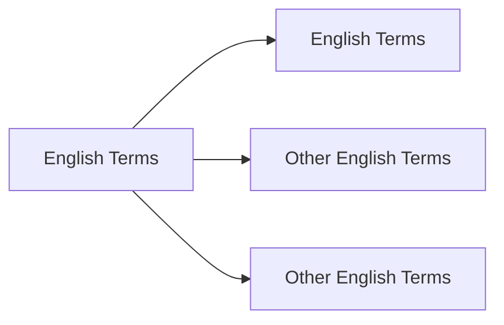

# **Unsheathed Terms Translation**  


# **Target to Finished**
No| Chapter | Days | Status |
 :---:|:---:| :---: | :--- |
1| 1-100 | 21-28 Dec 2024| 🚗 _On Progress_ |
2| 101-200 | 29 Dec- 5 Jan 2024| ❌ _Not Yet_ |


## Chapter 1 - 100  


```
New Terms
```



Translate based on [Gemini](www.gemini.google.com) and [ChatGPT](www.chatgpt.com)

>Mengembang
***
+ Bulging


>Naik
***
+ Perked
+ Perked Up

>Terus Menerus
***
+ Perpetually

>Sendawa
***
+ Burping

>Tegukan Besar
***
+ Swig 

>Besar
***
+ Immense

> Berjalan Perlahan
***
+ Shuffled Over

> Muncul Kembari
***
+ Resurfaced


> Tetes
***
+ Drip
+ Blob

> Batu Tulis
***
+ Slate

> Berair Enak
***
+ Succulent

> Teredam (Suara)
***
+ Muffled

> Cemplung
***
+ Plop


> Memikat
***
+ Bewitching

> Menggulung
***
+ Reeling in

> Hembusan Angin
***
+ Rustle

> Padi


***
+ Reeds 
+ Paddy (area)

> Miring
***
+ Cocked
+ Tilt

> Jalan Dengan Hati Hati
***
+ Discreetly
+ Tip-toe 

> Mengepakkan
***
+ Flapping
+ Fluttering

> Membalikkan
***
+ Flipping
 
> Terjatuh (Dengan Suara)
***
+ Flopping

> Berlari (Dengan Langkah Kecil) / Bergegas
***
+ Scurried

> Mengapung (Di Udara, biasanya bau)
***
+ Wafted

> Mengepal Gigi 
***
+ Clenched
+ Gritted
+ Grin


> Menyeramkan
***
+ Ghastly
+ Eerie

> Objek yang bisa diikat
***
+ To Knot

> Ditenun
***
+ Weaved

> Kosong
***
+ Vacant

> Kilau 
***
+ Glistening
+ Sparkle
+ Dazzling

> Menjadi Kusam/Hitam
***
+ Glimmering

> Melemparkan
***
+ Slung
+ Sling

> Ngomong Gak Jelas
***
+ Waffling

> Roti
***
+ Buns

> Menangani
***
+ Tackling

> Menghabiskan
***
+ Gobble

> Menyayangi
***
+ Doting

> Lobang Perbedaan
***
+ Gulf 
+ Gap

> Tidak Mencolok
***
+ Inconspicious

> Pelahap (makan banyak)
***
+ Glutton


> Kepuasan
***
+ Gratication

> Mengejek
***
+ Scoff

> Melahap Makanan
***
+ Scoff down

> Piring
***
+ Dish

> Ngorok
***
+ Snored

> Hama
***
+ Vermin

> Merangkak
***
+ Crawled

> Tajam 
***
+ Pricked

