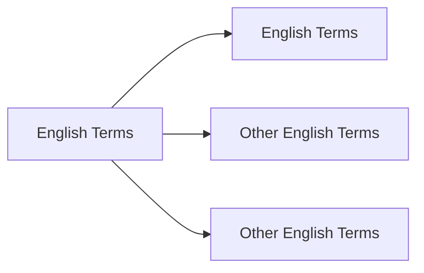

# **Unsheathed Terms Translation**  


# **Target to Finished**
No| Chapter | Days | Status |
 :---:|:---:| :---: | :--- |
1| 1-100 | 21-28 Dec 2024| 🚗 _On Progress_ |
2| 101-200 | 29 Dec- 5 Jan 2024| ❌ _Not Yet_ |


## Chapter 1 - 100  

s


```
New Terms
```



Translate based on [Gemini](www.gemini.google.com) and [ChatGPT](www.chatgpt.com)

>Mengembang
***
+ Bulging


>Naik
***
+ Perked
+ Perked Up

>Terus Menerus
***
+ Perpetually
+ Incessantly

>Sendawa
***
+ Burping

>Tegukan Besar
***
+ Swig 

>Besar
***
+ Immense

> Berjalan Perlahan
***
+ Shuffled Over

> Muncul Kembari
***
+ Resurfaced


> Tetes
***
+ Drip
+ Blob

> Batu Tulis
***
+ Slate

> Berair Enak
***
+ Succulent

> Teredam (Suara)
***
+ Muffled

> Cemplung
***
+ Plop


> Memikat
***
+ Bewitching

> Menggulung
***
+ Reeling in

> Hembusan Angin
***
+ Rustle

> Padi


***
+ Reeds 
+ Paddy (area)

> Miring
***
+ Cocked
+ Tilt

> Jalan Dengan Hati Hati
***
+ Discreetly
+ Tip-toe 

> Mengepakkan
***
+ Flapping
+ Fluttering

> Membalikkan
***
+ Flipping
 
> Terjatuh (Dengan Suara)
***
+ Flopping

> Bergegas
***
+ Scurried
+ Briskily (Lari Dengan Cepat)
> Mengapung (Di Udara, biasanya bau)
***
+ Wafted

> Mengepal Gigi 
***
+ Clenched
+ Gritted
+ Grin


> Menyeramkan
***
+ Ghastly
+ Eerie

> Objek yang bisa diikat
***
+ To Knot

> Ditenun
***
+ Weaved

> Kosong
***
+ Vacant

> Kilau 
***
+ Glistening
+ Sparkle
+ Dazzling (Mempesona)

> Menjadi Kusam/Hitam
***
+ Glimmering

> Melemparkan
***
+ Slung
+ Sling

> Ngomong Gak Jelas
***
+ Waffling

> Roti
***
+ Buns

> Menangani
***
+ Tackling

> Menghabiskan
***
+ Gobble

> Menyayangi
***
+ Doting

> Lobang Perbedaan
***
+ Gulf 
+ Gap

> Tidak Mencolok
***
+ Inconspicious

> Pelahap (makan banyak)
***
+ Glutton


> Kepuasan
***
+ Gratication

> Mengejek
***
+ Scoff

> Melahap Makanan
***
+ Scoff down

> Piring
***
+ Dish

> Ngorok
***
+ Snored

> Hama
***
+ Vermin

> Merangkak
***
+ Crawled

> Tajam 
***
+ Pricked

> Bergemuruh
***
+ Rumble

> Bergumam
***
+ Muttering
+ Mumbling

> Mengeluh
***
+ Grumbling

> Pemandangan yang mengganggu
***
+ Eyesore

> Nyonya
***
+ Missus

> Mati Rasa
***
+ Numb

> Omong Kosong
***
+ Gibberish

> Terbelakang
***
+ Retard

> Memperoleh
***
+ Elicit

> Jalan
***
+ Stride (Melangkah)
+ Stroll (Jalan)
+ Scurried (Jalan dengan langkah kecil)

> Mengepul
***
+ Billowing

> Memaki 
***
+ Cuss

> Melolong (kayak au nya serigala)
***
+ Howling

> Orang Celaka
***
+ Wretch
+ Deplorable (sambil mengukut untuk orang celaka)

> Bahan Lilin
***
+ Wax

> Pekerjaan Sehari Hari (Rumah Tangga)
***
+ Chores

> Rumput
*** 
+ Lawn

> Gak Peduli (Bahagia)
***
+ Frivolous

> Menanam
***
+ Sow

> Bingung
***
+ Mystified
+ Baffled
+ Bewildered
+ Persprelexed


> Berfikir
***
+ Mused (Think Deeply)
+ Mulled Over 

> Insinuation
***
+ Petunjuk Kecil (clue)

> Menentang
***
+ Against

> Kaget
***
+ Jolted

> MenggantI Rugi
***
+ Compensate(Membayar/Mengimbangi)

> Jatuh Cinta
***
+ Fallen Heads Over Heels

> Shoo
***
+ Mengusir

> Nakal
***
+ Sly

> Mengganggu
***
+ Pester
+ Nag

> Tutup Barang
***
+ Lid

> Menyempitkan Mata
***
+ Squinted

> Suara Nada Tinggi
***
+ Squeak

> Pangsit Cinta
*** 
+ Wontons

> Berantakan
****
+ Disheveled
+ Scruffy
+ Unkempt

> Kesal
***
+ Infuriated

> Mengintip
***
+ Peep

> Menjilat 
***
+ Obsequiously
+ Fawning(berlebihan dalam memuji)

> Cerita
***
+ Recounts

> Terlarang
***
+ Illicit

> Dengan Panik
***
+ Frantically

> Sesuatu yang Besar
***
+ Heap

> Berteriak
***
+ Hooted

> Mencemooh
***
+ Heckled

> Berlari dengan Cepat
***
+ Scooted

> Mereda
***
+ Subsided

> Kehijauan
***
+ Verdant
+ Lush

> Tidak Sejalan / Tidak Sesuai
***
+ Discordant
+ Erratic

> Keriput
***
+ Shriveled
+ Wrinkled

> Menjijikan
***
+ Vile
+ Repulsive
+ Loathing
+ Abhorrent

> Cemberut
***
+ Sullent

>  Tidak Penting 
***
+ Trifling

> Memecah
***
+ Wrack

> Kerinduan
***
+ Reminisence

> Berbicara Gagap 
***
+ Stutter
+ Stammered

> Halus
***
+ Fluffy

> Tertawa Kecil
***
+ Giggle

> Terpendam
***
+ Repressed
+ Pent-Up

> Tidak Komunikatif / Pasif / Pendiam
***
+ Taciturn
+ Reserved

> Berani / Sopan(sehingga cenderung menarik perhatian cwe)
***
+ Gallant
+ Chivalrous


> Permintaan yang sungguh sungguh
***
+ Pleading
+ Appeal

> Benci
***
+ Enmity
+ Bitterness
+ Animosities
+ Loath

> Mencekik / Membatasi
***
+ Stifling
+ Suffocating

> Menunjukkan Sifat Tidak Setuju dalam keadaan Serius
***
+ Stern

> Tidak Pasti Karena Bahaya
***
+ Precarious
+ Perilous (Pasti Bahaya)

> Menjelaskan secara Rinci 
***
+ Eludicate
+ Expounding

> Kesal 
***
+ Tick Off
+ Irritated

> Memukul
***
+ Banging

> Menarik
***
+ Tugged
+ Jerked

> Menyerah
***
+ Relenting

> Besar dan Kuat 
***
+ Burly

> Benjol / Membesar 
***
+ Swollen
+ Turgid

> Semangat / Yakin / Tertarik dengan sungguh sungguh
***
+ Fervent
+ Fervor
+ Frienziedly
+ Zealously

> Sangat Panas
***
+ Searing
+ Scorching

> Tenang
***
+ Composed
+ Collected

> Sombong / Merasa Diatas
***
+ Haughty
+ Condescending
+ Snobbish

> Resah
***
+ Agitation
+ Trepidation

> Hampir (Tapi ga terpenuhi)
***
+ Measly

> Ditebang
***
+ Felled

> Hujan Lebat
***
+ Downpours

> Atap dari Jerami atau Tanaman Semak
***
+ Thatched

> Sumber Sumur(Sumber Airnya)
***
+ Wellheads

> Gudang Penyimpanan
***
+ Trove

> Keributan
***
+ Fuss

> Kepala yang jatuh terlebih dahulu
***
+ Faceplanted

> Jalan di sebuah gunung cenderung ke atas
***
+ Ridge

> Tertidur tanpa Sengaja
***
+ Doze off

> Dengan Enggan, tapi tetap dilakukan
***
+ Begrudging

> Berjalan di Air
***
+ Waded

> Memeriksa sesuatu dengan hati hati
***
+ Sift

> Batu besar yang halus
***
+ Boulders

> Bintik
***
+ Specks

> Ekspresi Wajah yang Jijik
***
+ Grimaced

> Menghiasi
***
+ Adorn
+ Embroidered

> Pernak Pernik Kecil
***
+ Trinkets

> Bau yang sensitif
***
+ Pungent

> Mengawetkan Makanan
***
+ Pickling

> Meretas
***
+ Hacking

> Menetaskan
***
+ Hatching

> Makan Dikit Dikit
***
+ Nibble

> Lincah
***
+ Nimble

> Berjalan dengan Hati Hati
***
+ Crept

> Bahan untuk tulis menulis
***
+ Parchment

> Setengah Tenggelam
***
+ Immersed

> Menggerakan dengan halus
***
+ Slid

> Mengatakan sesuatu dengan tiba tiba
***
+ Blurt

> Tidak Menyenangkan
***
+ Unsavory

> Skirmish
***
+ Peperangan

> Jalan Besar
***
+ Swathes

> Kental
***
+ Viscous

> Mengecil / Kempes
***
+ Deflated

> Sulit untuk ditangkap
***
+ Elusive

> Melahirkan
***
+ Begets

> Tas dengan Tali 
***
+ Satchel

> Mengikat / Alat Ikat Pintu
***
+ Latch

> Ceroboh
***
+ Wanton

> Pengkhianatan
***
+ Treasonous

> Digoyangkan
***
+ Swayed

> Simpul
***
+ Knot

> Rajutan
***
+ Knit

> Kering
***
+ Parched

> Bergerak dengan cepat
***
+ Flitter

> Aktivitas pada Daratan
***
+ Onshore

> Aktivitas pada Lautan
***
+ Offshore

> Tanduk
***
+ Antler

> Bingung
***
+ Daze

> Semak Berduri
***
+ Hawthorns

> Aneh
***
+ Eccentric

> Menyenggol
***
+ Nudge

> Menggemaskan
***
+ Adorable

> Kesuksesan Di Masa Depan
***
+ Auspiciousness

> Meremehkan
***
+ Belittling

> Menepis
***
+ Brushed over it

> Gak Cocok
***
+ Misfit

> Bergerak 
***
+ Wiggle (Mengerakkan ke samping)
+ Wriggle (Mengerakkan masuk keluar)

> Praktik Disiplin garis keras
***
+ Ascetic

> Menaklukkan
***
+ Subjugate

> Dengan usaha yang keras
***
+ Strenous

> Pembantu(tapi tingkatannya lebih tinggi karena mengurus properti)
***
+ Steward

> Teliti
***
+ Meticulous

> Pengikut
***
+ Retainers

> Menggelantung ke bawah
***
+ Drooped

> Merapatkan / Memeluk
***
+ Snuggled

> Memabukkan
***
+ Intoxicating

> Mengakui
***
+ Concede

> Menonjol
***
+ Protrude

> Mendidih
***
+ Simmering

> Dimasak dengan Merebus
***
+ Brasising

> Usil
***
+ Nosy

> Pucat
***
+ Ashen
+ Pale

> Cemberut
***
+ Sulky

> Menyindir
***
+ Quipped

> Hemat
***
+ Thrifty
+ Frugal

> Menampakkan kesedihan
***
+ Melancholic
+ Gloomy
+ Pensive
+ Wistful
+ Forlorn
+ Grief-Stricken

> Bermalas malasan
***
+ Slack off
+ Perfunctory(gak malas, tapi effortnya sedikit)

> Dengan Mahir
***
+ Adeptly

> Menyeduh
***
+ Brew

> Kuda Kuda
***
+ Stances

> Stringent
***
+ Ketat

> Memutar
***
+ Twirling (lebih ke daun yang berputar setelah jatuh dari pohon)

> Goyah
***
+ Wobbed 
+ Waver

> Dengan Tajam
***
+ Acutely

> Aneh tapi menarik
***
+ Eccentric
+ Quirky

> Jelek
***
+ Shoddy

> Berbahaya
***
+ Detrimental
+ Prejudicial

> Apprehensive
***
+ Khawaitr
+ Uneasy

> Meningkatkan
***
+ Temper(as a verb)

> Menilai
***
+ Appraise

> Pagar
***
+ Railings

> Berbelok
***
+ Veered off
+ Swerve

> Kaku
***
+ Clumsy

> Benda Pusaka
***
+ Heirloom

> Dengan Sombong
***
+ Smugly

> Nginjek
***
+ Trample
+ Stomp

> Jatuh dengan kecepatan tinggi
***
+ Plummet

> Batu Asah
***
+ Whestone

> Menunjukkan Ketidaktertarikkan
***
+ Indifferent 

> Keramahan
***
+ Hospitality

> Mengidamkan
***
+ Coveting

> Kutil
***
+ Wart

> Lembah
***
+ Valley
+ Gorge(noun)

> Lari dengan Cepat(dimana semua kaki sampai tidak menyentuh tanah)
***
+ Galloping

> Menahan (Di bawah kendali)
***
+ In Check(idiom)

> Bergejolak
***
+ Upheaval

> Bergetar hebat
***
+ Convulsing

> Menurun
***
+ Waned

> Dipaksakan
***
+ Labored

> Lihai
***
+ Wily

> Pengungian
***
+ Refuge

> Tambahan
***
+ Afterthought

> Melemparkan
***
+ Hurl

> Tipuan / Umpan
***
+ Ruse

> Meronta Ronta
***
+ Flailed

> Tertawa
***
+ Chuckle
+ Chortle

> Gembira
***
+ Glee

> Keraguan
***
+ Qualms

> Konsekuensi/ Hasil yang tidak diinginkan
***
+ Repercussions

> Kesalahan
***
+ Oversights
+ Lapse

> Pengeluaran
***
+ Expenditure

> Memastikan
***
+ Ascertained

> Memeras (dengan cara yang curang)
***
+ Extorted

> Mengambil
***
+ Pounced

> Bobrok (rusak)
***
+ Dilapidated

> Posisi 
***
+ Stead

> Bahagia 
***
+ Elated
+ Ecstatic

> Enak 
***
+ Delectable

> Tidak Semangat
***
+ Lackadaisical
+ Despondence

> Perdebatan
***
+ Altercation

> Gelandangan
***
+ Vagrant

> Membangun
***
+ Erected

> Kecenderungan
***
+ Propensity

> Menggoyangkan Jari 
***
+ Wagged

> Tangan Membentuk Sebuah Gelas (untuk menandakan hormat)
***
+ Cupped

> Masa Kejayaan
***
+ Heyday

> Tugas
***
+ Errand

> Intisari
***
+ Gist

> Dihancurkan sepenuhnya
***
+ Pulverized

> Ampuni
***
+ Pardon

> Tontonan
***
+ Spectacle

> Kapalan
***
+ Callouses

> Meresap
***
+ Permeating

> Memanfaatkan
***
+ Harness

> Baskom
***
+ Basins

> Marah karena perasaan tidak adil 
***
+ Indignant 

> Memohon dengan sungguh sungguh
***
+ Implored

> Ekspresi Lelah
***
+ Weary

> Take Matter
***
+ Mengambil Tindakan

> Ketabahan
***
+ Fortitude

> Berkumpul
***
+ Flock

> Perhatian 
***
+ Considerate

> Pikun
***
+ Senile

> Gagasan
***
+ Notion

> Ranting Kecil 
***
+ Twig

> Tidak Semestinya
***
+ Undue

> Jaminan
***
+ Bail

> Situasi yang Sulit 
***
+ Predicament

> Kurus Bertulang
***
+ Scrawny

> Tercampur
***
+ Mingled

> Kecil
***
+ Petty

> Menimbulkan
***
+ Inflict

> Ingkar Janji
***
+ Renege

> Kurang Sopan Santun
***
+ Uncouth

> Yang Mengetahui Rahasia
***
+ Privy

> Menyerah 
***
+ Relinquish

> Dikeluarkan
***
+ Incurred

> Curam
***
+ Steep

> Pengamat
***
+ Bystander

> Dibuat buat 
***
+ Contrived

> Kapak + Tombak (Senjata Gabungan)
***
+ Halberd

> Melakukan segala cara 
***
+ Leave no stone unturned (idiom)

> Sangat Menyakitkan 
***
+ Excruciating

> Compang Camping
***
+ Ragged

> Menjahit 
***
+ Needlework

> Melihat Dengan Derajat Yang Sama 
***
+ Peering

> Dengan Susah Payah
***
+ Arduously

> Siksaan / Rintangan
***
+ Arduously

> Memancing / Memprovokasi 
***
+ Goad

> Membayangkan
***
+ Envisioned

> Berasal dari 
***
+ Hailing

> Penuh
***
+ Fraught

> Berisik dan Tidak Teratur
***
+ Rowdy

> Memaksakan
***
+ Imposing

> Menarik Sesuatu yang Berat 
***
+ Hauling

> Posisi
***
+ Vantage

> Geraman
***
+ Snarl

> Mengeras menjadi butiran yang sebelumnya tetesan kecil 
***
+ Beaded up

> Menepuk 
***
+ Swatted

> Kecuali 
***
+ Barring

> Perawakan 
***
+ Stature

> Menegur 
***
+ Reprimanded

> Diselempangkan
***
+ Slung

> Keributan
***
+ Commotion

> Memberikan Isyarat 
***
+ Beckoned

> Kata Kata Kutukan 
***
+ Profanity

> Mengurangi (Secara Bertahap)
***
+ Chip away

> Mendorong 
***
+ Propelling

> Menggelantung
***
+ Dangling

> Pendidikan 
***
+ Upbringing

> Parit / Got
***
+ Ditch

> Meletus Keluar 
***
+ Erupted out

> Penghargaan 
***
+ Accolades

> Luka Ringan 
***
+ Grazed

> Dengan Cepat (Tidak Peduli)
***
+ Breakneck

> Campuran (tanah, pasir dan debu) 
***
+ Loamy

> Mencengkeram
***
+ Latched

> Terjun 
***
+ Plunging

> Diperkecil 
***
+ Tapered

> Bernafas Dengan Cepat 
***
+ Panting

> Kera Baju Di Tangan 
***
+ Hem

> Menangis dengan Keras 
***
+ Bawling

> Merasakan Penghinaan 
***
+ Scorned

> Cemberut 
***
+ Sulky

> Serak 
***
+ Hoarse
+ Raucous

> Bersamaan (dalam konteks mengeluarkan suara)
***
+ Chorus

> Dengan Sopan 
***
+ Courteously
+ Graciously

> Kedai 
***
+ Tavern

> Mundur 
***
+ Flinched Back 
* Recoiled

> Bertemperamen Buruk (Marahan)
***
+ Surly

> Bersemangat
***
+ Feisty

> Punggungnya Menonjol
***
+ Hunched-Backed

> Garments 
***
+ Baju / Celana

> Titik Transisi / Ujung sebelum transisi
***
+ Cusp

> Memutuskan 
***
+ Sever

> Dengan Kotor / /Ga Jelas
***
+ Smudged

> Mengisi / Mengisi Ulang
***
+ Replenish

> Bagian Rahang / Tenggorokan Hewan
***
+ Maw

> Mendahului dalam posisi 
***
+ Overtaking

> Kebobolan 
***
+ Too Much Grounded

> Shudder 
***
+ Gemetar Luar Biasa

> Jatuh Secara Tiba Tiba 
***
+ Tumble

> Diletakkan Bersampingan 
***
+ Juxtaposed

> Dalam Bahaya / Jelas Jelas
***
+ Sanguine

> Meletakkan 
***
+ Wracked

> Menangis Karena Kesakitan 
***
+ Whimpered

> Membuka Mulut Lebar Lebar 
***
+ Yawning

> Menusuk dengan jari 
***
+ Prot 

> Menyerupai Lelucon 
***
+ Farcical

> Berbentuk Bulat 
***
+ Plump(Adjective)

> Berbicara Sesuatu yang tidak menarik 
***
+ Rattle on
+ Babbling 
+ Jabbing
+ Rambling

> Rakus 
***
+ Avaricious

> Tirai 
***
+ Drape

> Percaya 
***
+ Reckon

> Momen Menarik 
***
+ Enthralling

> Dengan Cara Yang Terampil 
***
+ Deftly

> Dengan Cara Yang Tidak Bisa Dirasakan 
***
+ Imperceptibly

> Misterius 
***
+ Uncanny

> Suara Yang Keras 
***
+ Thump

> Luka Panjang 
***
+ Gash

> Mendorong dengan keras 
***
+ Thrust

> Duduk dengan Berat 
***
+ Plonked