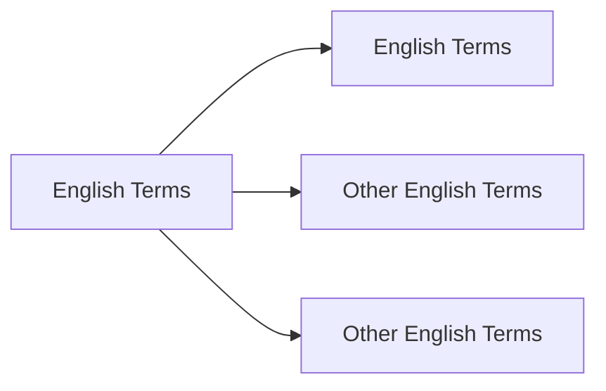

# **Unsheathed Terms Translation**  


# **Target to Finished**
No| Chapter | Days | Status |
 :---:|:---:| :---: | :--- |
1| 1-100 | 21-28 Dec 2024| 🚗 _On Progress_ |
2| 101-200 | 29 Dec- 5 Jan 2024| ❌ _Not Yet_ |


## Chapter 1 - 100  


```
New Terms
```



Translate based on [Gemini](www.gemini.google.com) and [ChatGPT](www.chatgpt.com)

>Mengembang
***
+ Bulging


>Naik
***
+ Perked
+ Perked Up

>Terus Menerus
***
+ Perpetually

>Sendawa
***
+ Burping

>Tegukan Besar
***
+ Swig 

>Besar
***
+ Immense

> Berjalan Perlahan
***
+ Shuffled Over

> Muncul Kembari
***
+ Resurfaced


> Tetes
***
+ Drip
+ Blob

> Batu Tulis
***
+ Slate

> Berair Enak
***
+ Succulent

> Teredam (Suara)
***
+ Muffled

> Cemplung
***
+ Plop


> Memikat
***
+ Bewitching

> Menggulung
***
+ Reeling in

> Hembusan Angin
***
+ Rustle

> Padi


***
+ Reeds 
+ Paddy (area)

> Miring
***
+ Cocked
+ Tilt

> Jalan Dengan Hati Hati
***
+ Discreetly
+ Tip-toe 

> Mengepakkan
***
+ Flapping
+ Fluttering

> Membalikkan
***
+ Flipping
 
> Terjatuh (Dengan Suara)
***
+ Flopping

> Bergegas
***
+ Scurried
+ Briskily (Lari Dengan Cepat)
> Mengapung (Di Udara, biasanya bau)
***
+ Wafted

> Mengepal Gigi 
***
+ Clenched
+ Gritted
+ Grin


> Menyeramkan
***
+ Ghastly
+ Eerie

> Objek yang bisa diikat
***
+ To Knot

> Ditenun
***
+ Weaved

> Kosong
***
+ Vacant

> Kilau 
***
+ Glistening
+ Sparkle
+ Dazzling

> Menjadi Kusam/Hitam
***
+ Glimmering

> Melemparkan
***
+ Slung
+ Sling

> Ngomong Gak Jelas
***
+ Waffling

> Roti
***
+ Buns

> Menangani
***
+ Tackling

> Menghabiskan
***
+ Gobble

> Menyayangi
***
+ Doting

> Lobang Perbedaan
***
+ Gulf 
+ Gap

> Tidak Mencolok
***
+ Inconspicious

> Pelahap (makan banyak)
***
+ Glutton


> Kepuasan
***
+ Gratication

> Mengejek
***
+ Scoff

> Melahap Makanan
***
+ Scoff down

> Piring
***
+ Dish

> Ngorok
***
+ Snored

> Hama
***
+ Vermin

> Merangkak
***
+ Crawled

> Tajam 
***
+ Pricked

> Bergemuruh
***
+ Rumble

> Bergumam
***
+ Muttering
+ Mumbling

> Mengeluh
***
+ Grumbling

> Pemandangan yang mengganggu
***
+ Eyesore

> Nyonya
***
+ Missus

> Mati Rasa
***
+ Numb

> Omong Kosong
***
+ Gibberish

> Terbelakang
***
+ Retard

> Memperoleh
***
+ Elicit

> Jalan
***
+ Stride (Melangkah)
+ Stroll (Jalan)
+ Scurried (Jalan dengan langkah kecil)

> Mengepul
***
+ Billowing

> Memaki 
***
+ Cuss

> Melolong (kayak au nya serigala)
***
+ Howling

> Orang Celaka
***
+ Wretch

> Bahan Lilin
***
+ Wax

> Pekerjaan Sehari Hari (Rumah Tangga)
***
+ Chores

> Rumput
*** 
+ Lawn

> Gak Peduli (Bahagia)
***
+ Frivolous

> Menanam
***
+ Sow

> Bingung
***
+ Mystified
+ Baffled
+ Bewildered
+ Persprelexed


> Berfikir
***
+ Mused (Think Deeply)
+ Mulled Over 

> Insinuation
***
+ Petunjuk Kecil (clue)

> Menentang
***
+ Against

> Jolted
***
+ Terkaget

> MenggantI Rugi
***
+ Compensate(Membayar/Mengimbangi)

> Jatuh Cinta
***
+ Fallen Heads Over Heels

> Shoo
***
+ Mengusir

> Nakal
***
+ Sly

> Mengganggu
***
+ Pester
+ Nag

> Tutup Barang
***
+ Lid

> Menyempitkan Mata
***
+ Squinted

> Suara Nada Tinggi
***
+ Squeak

> Pangsit Cinta
*** 
+ Wontons

> Berantakan
****
+ Dishoveled
+ Scruffy

> Kesal
***
+ Infuriated

> Mengintip
***
+ Peep

> Menjilat 
***
+ Obsequiously

> Cerita
***
+ Recounts

> Terlarang
***
+ Illicit

> Dengan Panik
***
+ Frantically

> Sesuatu yang Besar
***
+ Heap

> Berteriak
***
+ Hooted

> Mencemooh
***
+ Heckled

> Berlari dengan Cepat
***
+ Scooted

> Mereda
***
+ Subsided

> Kehijauan
***
+ Verdant
+ Lush

> Tidak Sejalan / Tidak Sesuai
***
+ Discordant

> Keriput
***
+ Shriveled
+ Wrinkled

> Menjijikan
***
+ Vile
+ Repulsive

> Cemberut
***
+ Sullent

>  Tidak Penting 
***
+ Trifling

> Memecah
***
+ Wrack

> Kerinduan
***
+ Reminisence

> Berbicara Gagap 
***
+ Stutter
+ Stammered

> Halus
***
+ Fluffy

> Tertawa Kecil
***
+ Giggle

> Terpendam
***
+ Repressed
+ Pent-Up

> Tidak Komunikatif / Pasif / Pendiam
***
+ Taciturn
+ Reserved

> Berani / Sopan(sehingga cenderung menarik perhatian cwe)
***
+ Gallant
+ Chivalrous

> Permintaan yang sungguh sungguh
***
+ Pleading
+ Appeal

> Benci
***
+ Enmity
+ Bitterness
+ Animosities

> Mencekik / Membatasi
***
+ Stifling
+ Suffocating

> Menunjukkan Sifat Tidak Setuju dalam keadaan Serius
***
+ Stern

> Tidak Pasti Karena Bahaya
***
+ Precarious
+ Perilous (Pasti Bahaya)

> Menjelaskan secara Rinci 
***
+ Eludicate
+ Expounding

> Kesal 
***
+ Tick Off
+ Irritated

> Memukul
***
+ Banging

> Menarik
***
+ Tugged

> Menyerah
***
+ Relenting

> Besar dan Kuat 
***
+ Burly

> Benjol / Membesar 
***
+ Swollen
+ Turgid

> Semangat / Yakin / Tertarik dengan sungguh sungguh
***
+ Fervent

> Sangat Panas
***
+ Searing
+ Scorching

> Tenang
***
+ Composed
+ Collected

> Sombong / Merasa Diatas
***
+ Haughty
+ Condescending

> Resah
***
+ Agitation
+ Trepidation

> Hampir (Tapi ga terpenuhi)
***
+ Measly

> Ditebang
***
+ Felled

> Hujan Lebat
***
+ Downpours

> Atap dari Jerami atau Tanaman Semak
***
+ Thatched

> Sumber Sumur(Sumber Airnya)
***
+ Wellheads

> Gudang Penyimpanan
***
+ Trove

> Keributan
***
+ Fuss

> Kepala yang jatuh terlebih dahulu
***
+ Faceplanted

> Jalan di sebuah gunung cenderung ke atas
***
+ Ridge

> Tertidur tanpa Sengaja
***
+ Doze off

> Dengan Enggan, tapi tetap dilakukan
***
+ Begrudging

> Berjalan di Air
***
+ Waded

> Memeriksa sesuatu dengan hati hati
***
+ Sift

> Batu besar yang halus
***
+ Boulders

> Bintik
***
+ Specks

> Ekspresi Wajah yang Jijik
***
+ Grimaced

> Menghiasi
***
+ Adorn
+ Embroidered

> Pernak Pernik Kecil
***
+ Trinkets

> Bau yang sensitif
***
+ Pungent

> Mengawetkan Makanan
***
+ Pickling

> Meretas
***
+ Hacking

> Menetaskan
***
+ Hatching

> Makan Dikit Dikit
***
+ Nibble

> Lincah
***
+ Nimble

> Berjalan dengan Hati Hati
***
+ Crept

> Bahan untuk tulis menulis
***
+ Parchment

> Setengah Tenggelam
***
+ Immersed

> Menggerakan dengan halus
***
+ Slid

> Mengatakan sesuatu dengan tiba tiba
***
+ Blurt

> Tidak Menyenangkan
***
+ Unsavory

> Skirmish
***
+ Peperangan

> Jalan Besar
***
+ Swathes

> Kental
***
+ Viscous

> Mengecil / Kempes
***
+ Deflated

> Sulit untuk ditangkap
***
+ Elusive

> Melahirkan
***
+ Begets

